# 🧘 瑜伽馆预约小程序

> 专为瑜伽馆/健身工作室打造的 **一站式预约管理 SaaS 平台**。告别微信群接龙和 Excel 排课，会员点一下就能约课，馆主打开手机就能管店。

---

## 💡 为什么需要它？

### 馆主的痛点

| 传统方式       | 痛点                                   | 本系统解决方案                             |
| -------------- | -------------------------------------- | ------------------------------------------ |
| 微信群接龙约课 | 漏约、重复约、人数超报、消息刷屏找不到 | ✅ 会员自助预约，自动控制人数，永不超报    |
| Excel 手动排课 | 费时费力，改一个时段全表重排           | ✅ 可视化排课，一键复制周课表，灵活调整    |
| 纸质签到表     | 找不到人、代签冒签、统计困难           | ✅ 扫码核销 + 二维码自助签到，数据自动汇总 |
| 会员卡靠记性   | 次数记错、过期忘提醒、退费扯皮         | ✅ 系统自动扣次，余额到期提醒，流水可查    |
| 多馆管理混乱   | 数据分散、无法统一管控                 | ✅ SaaS 多租户架构，一个超管管所有馆       |

### 会员的体验

```
打开小程序 → 浏览日历 → 选择课程/教练 → 一键预约 → 到店扫码签到
     ↓                                              ↓
 首页推荐                                     自动扣减会员卡次数
 公告通知                                     预约提醒推送
 教练介绍                                     随时查看预约记录
```

---

## 🌟 产品亮点

### 📅 智能预约系统

- **灵活排课**：自定义每天时段、人数上限、开始/截止预约时间
- **双模式预约**：支持「教练预约」和「课程预约」两种业务模式
- **自定义表单**：预约时可收集会员信息（身高/体重/健康状况等自定义字段）
- **防超报机制**：系统自动锁定已满时段，杜绝超额预约
- **候补与取消**：会员可自助取消，释放名额给其他会员

### 🎫 会员卡务管理

| 卡类型     | 说明                 | 场景举例                   |
| ---------- | -------------------- | -------------------------- |
| **次卡**   | 按次数扣减，用完为止 | 10 次瑜伽通卡、20 次私教卡 |
| **储值卡** | 按金额扣减，余额可查 | 充值 3000 送 500           |
| **期限卡** | 有效期内不限次       | 月卡、季卡、年卡           |

- 支持发卡、激活、充值、扣费、退卡全流程
- 每笔交易自动记录流水，对账清晰
- 卡务数据可导出 Excel

### 📊 经营数据看板

馆长打开手机就能看到：

- 📈 **预约数据**：今日/本周/本月预约量、到课率
- 👥 **会员分析**：活跃会员数、新增趋势、流失预警
- 💰 **营收统计**：卡务收入、消课进度、资金流水
- 🏆 **排行榜**：教练到课排名、热门课程排名
- 📋 **排课统计**：各时段上座率、课程热度分析

### 👨‍🏫 教练与员工管理

- **微信绑定登录**：教练用微信扫码即可绑定，无需记密码
- **角色权限分离**：馆长管全局，教练只管自己的课
- **多馆支持**：一个教练可绑定多个馆，自由切换
- **教练主页**：自动生成教练展示页（头像、简介、专长、风采照）

### 🏢 SaaS 多租户架构

```
                    ┌─────────────┐
                    │  超级管理员   │
                    └──────┬──────┘
            ┌──────────────┼──────────────┐
            ▼              ▼              ▼
      ┌─────────┐   ┌─────────┐   ┌─────────┐
      │ 静心瑜伽馆 │   │ 健心瑜伽馆 │   │ 更多瑜伽馆 │
      │  独立运营  │   │  独立运营  │   │  独立运营  │
      └─────────┘   └─────────┘   └─────────┘
```

- 每个馆**数据完全隔离**，互不干扰
- 每个馆可**独立配置**首页横幅、公告、课程、教练
- 超管可**统一管控**所有馆，按需开启/关闭功能模块
- 支持为不同馆配置**定制首页模板**

---

## 📱 功能模块一览

### 会员端（用户使用）

> 会员打开小程序即可使用，无需下载额外应用

**🏠 首页**

- 横幅广告轮播
- 滚动公告通知
- 教练团队展示
- 照片墙/馆内环境
- 热门课程推荐

**📅 约课**

- 日历视图浏览可约时段
- 按周查看课表
- 课程详情（教练、时间、剩余名额）
- 一键预约 + 自动扣卡

**📖 课程**

- 瑜伽动态（馆内资讯）
- 瑜伽常识（科普文章）
- 按分类浏览课程

**👤 我的**

- 我的预约（待开始/已完成/已取消）
- 会员卡包（余额/次数/有效期）
- 私教预约记录
- 个人资料管理

### 教练端（馆长/教练使用）

> 通过微信绑定登录，进入管理界面

**🏠 工作台** — 今日数据概览、快捷操作入口

**👥 客户管理** — 会员列表、消费记录、卡务调整

**📋 排课** — 创建课程、设置时段、复制周课表

**📅 预约** — 查看名单、现场核销、生成签到码

**📊 统计** — 到课率、排课统计、营收分析、排行榜

**🎫 卡务** — 卡模板管理、发卡、用户卡管理

**🏫 私教** — 一对一私教课程排期与预约

**🏠 首页内容** — 横幅/公告/照片墙的新增、编辑、删除

**👨‍🏫 员工** — 添加教练/馆长、生成微信绑定码

**📝 资讯** — 发布/编辑/删除馆内动态和常识文章

### 平台管理（超级管理员）

> 统一管理所有入驻瑜伽馆

- 创建新瑜伽馆（租户）
- 为各馆指定馆长和教练
- 查看全平台运营数据
- 按租户控制功能开关

---

## 🔐 角色与权限

### 谁能用什么？

| 功能          | 超级管理员 |  馆长   |  教练   |
| ------------- | :--------: | :-----: | :-----: |
| 创建新瑜伽馆  |     ✅     |   ❌    |   ❌    |
| 管理本馆员工  | ✅ 全部馆  | ✅ 本馆 |   ❌    |
| 排课/管理预约 |     ✅     |   ✅    |   ✅    |
| 首页内容管理  |     ✅     |   ✅    |   ✅    |
| 卡务管理      |     ✅     |   ✅    |   ❌    |
| 会员管理      |     ✅     |   ✅    |  只读   |
| 经营数据统计  | ✅ 全平台  | ✅ 本馆 | ✅ 本馆 |
| 系统设置      |     ✅     |   ✅    |   ❌    |

### 登录方式

| 角色       | 登录方式 | 说明                              |
| ---------- | -------- | --------------------------------- |
| 超级管理员 | 账号密码 | 教练版「超管密码登录」入口        |
| 馆长       | 微信绑定 | 超管/馆长生成绑定码，微信扫码绑定 |
| 教练       | 微信绑定 | 同上，馆长可为教练生成绑定码      |

> 💡 一个微信号可绑定多个馆，教练在不同馆之间自由切换。

---

## 🚀 快速上手

### 第一步：开通云环境

1. 注册微信小程序账号，开通**云开发**
2. 记下你的**云环境 ID** 和 **AppID**

### 第二步：配置项目

1. 用微信开发者工具导入项目
2. 替换云环境 ID（共两处）：
   - [`miniprogram/setting/setting.js`](miniprogram/setting/setting.js) → `CLOUD_ID`
   - [`cloudfunctions/cloud/config/config.js`](cloudfunctions/cloud/config/config.js) → `CLOUD_ID`

### 第三步：部署云函数

- 右键 `cloudfunctions/cloud` → **上传并部署：云端安装依赖**

### 第四步：初始化数据

- 编译模式启动参数填 `route=test/seed`
- 控制台显示「Seed 成功」即创建好测试数据

### 第五步：开始体验

- 会员端：编译运行 → 选择瑜伽馆 → 浏览约课
- 教练端：会员端「我的」→ 后台管理 → 密码登录或绑定码登录

---

## 🧪 体验账号

部署后可用以下账号体验完整功能：

| 角色          | 账号          | 密码     | 所属馆     |
| ------------- | ------------- | -------- | ---------- |
| 🔴 超级管理员 | `admin`       | `123456` | 全平台     |
| 🟢 馆长       | `13900000000` | `123456` | 静心瑜伽馆 |
| 🟡 教练       | `13900000001` | `123456` | 静心瑜伽馆 |
| 🟢 馆长       | `13900000003` | `123456` | 健心瑜伽馆 |

> ⚠️ 密码登录仅用于超管或备用，馆长/教练推荐使用微信绑定码登录。

---

## 📸 产品截图

### 会员端

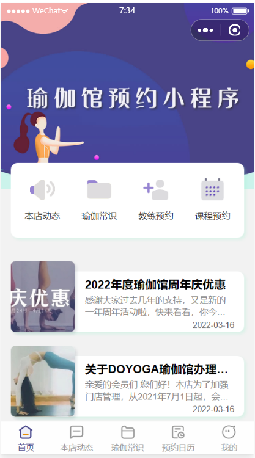
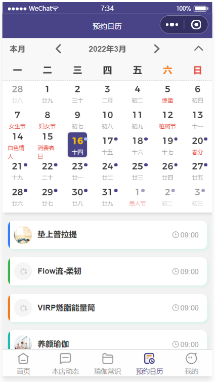

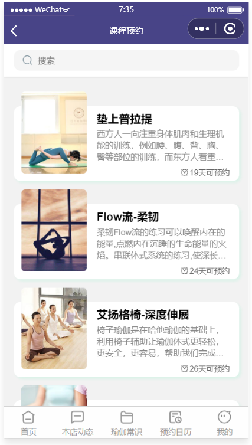
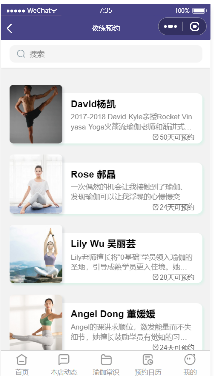
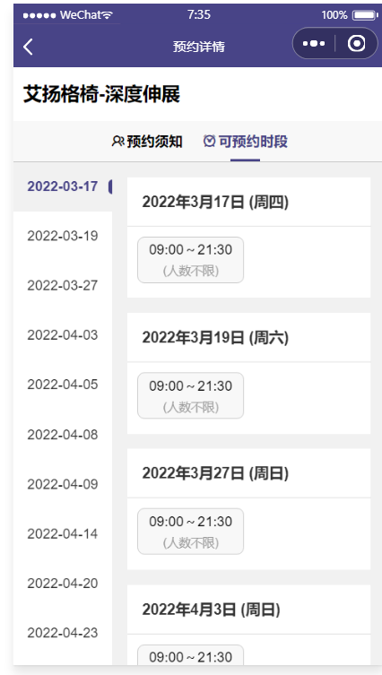

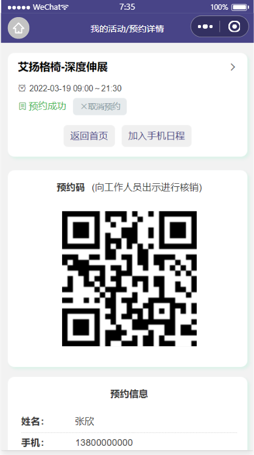
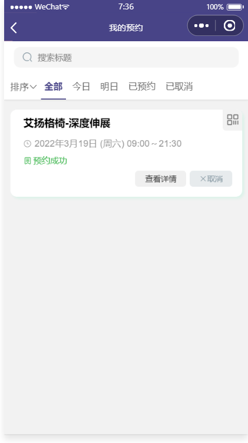


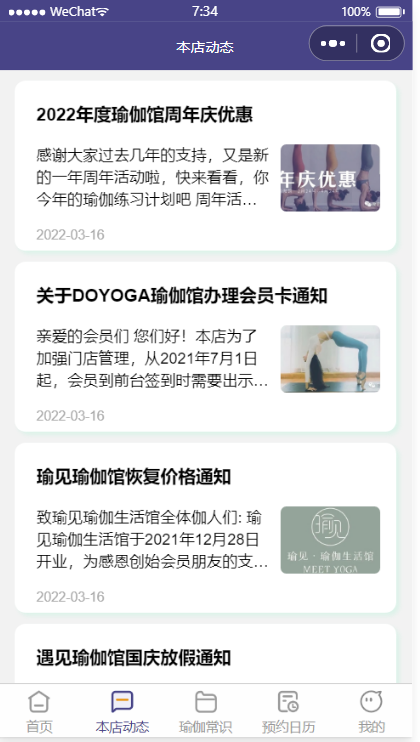

### 管理后台

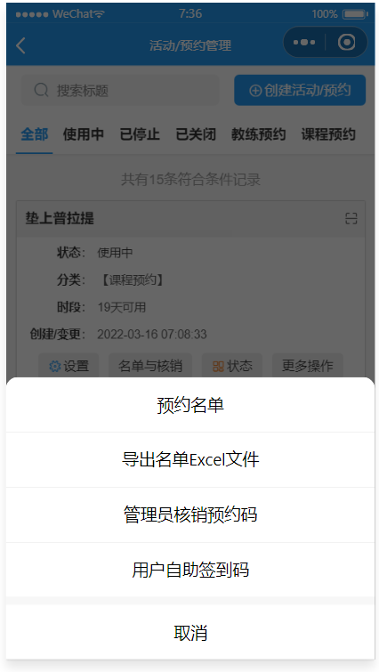
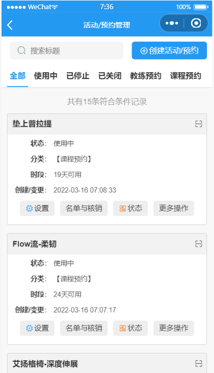
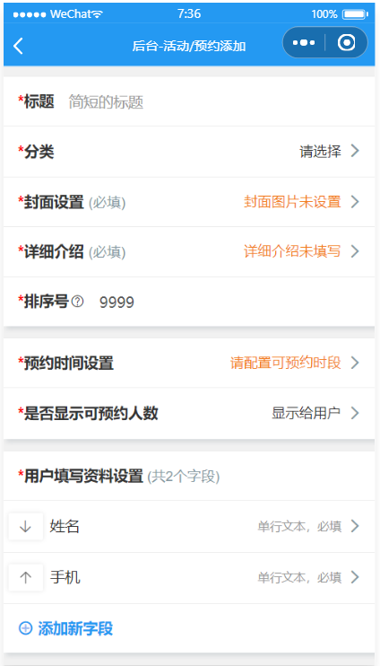

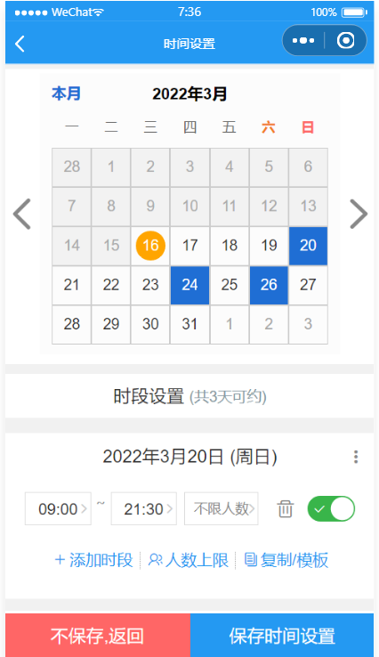
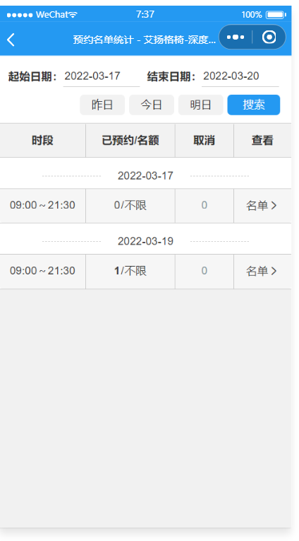
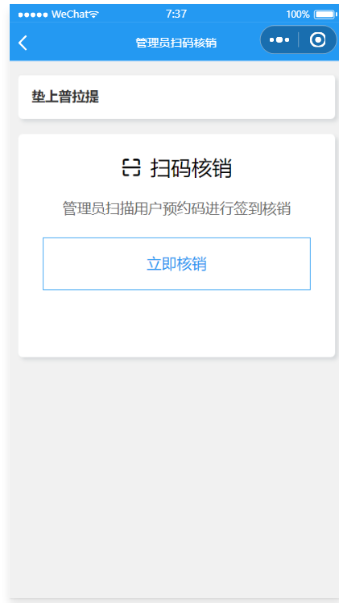

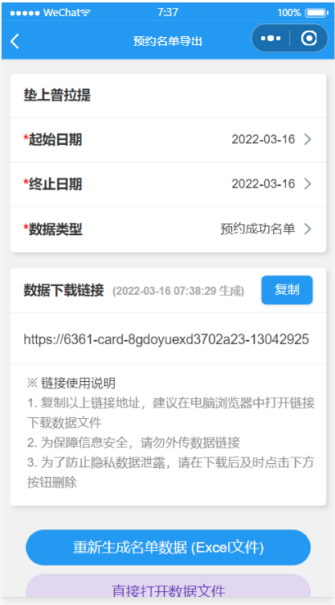

---

## 🛠 技术方案

> 面向开发者的技术信息

| 项         | 说明                                     |
| ---------- | ---------------------------------------- |
| **前端**   | 微信小程序原生 + VANT Weapp 组件库       |
| **后端**   | 微信云开发（云函数 + 云数据库 + 云存储） |
| **架构**   | MVC 三层（Controller → Service → Model） |
| **多租户** | 基于 `_pid` 字段逻辑隔离，动态租户选择   |
| **主题**   | CSS 变量动态换色，三端独立主题           |
| **数据库** | 16 个集合（会员/课程/预约/卡务/资讯等）  |

### 核心目录

```
miniprogram/          # 小程序前端
├── pages/default/    #   会员端页面
├── pages/coach/      #   教练/馆长管理页面
├── pages/admin/      #   超管平台页面
└── setting/          #   全局配置

cloudfunctions/cloud/ # 云函数后端
├── config/route.js   #   API 路由表
├── project/
│   ├── controller/   #   业务控制器
│   ├── service/      #   业务逻辑
│   └── model/        #   数据模型
└── framework/        #   框架核心
```

### 正式上线前必做

1. `cloud/config/config.js` → `TEST_MODE: false`（关闭测试模式）
2. 修改超管账号密码（`ADMIN_NAME` / `ADMIN_PWD`）
3. 上传云函数 + 构建 npm + 提交审核

---

## 📞 联系方式

如有疑问、功能建议、定制开发需求，欢迎联系交流。

---

## 📄 版本信息

- 当前版本：`build 2022.02`
- 技术栈：微信小程序 + 云开发
- 适用场景：瑜伽馆 / 健身房 / 舞蹈工作室 / 私教工作室 等预约制服务行业
