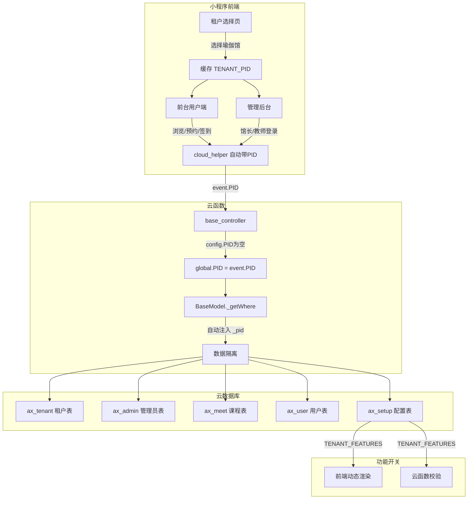
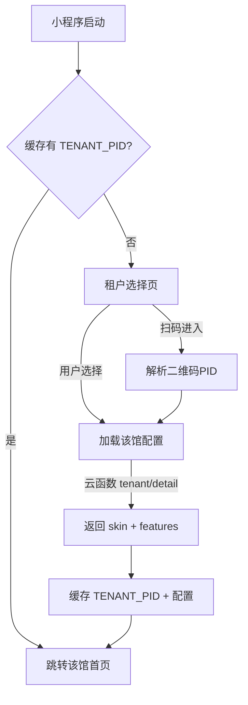
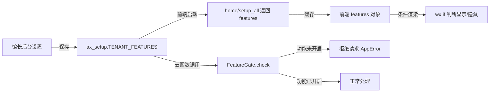

# 瑜伽馆 SaaS 多租户架构设计方案

> 基于 CCMiniCloud Framework 2.0.1，在现有单项目架构上改造为单小程序多租户模式。

---

## 一、整体架构总览



### 核心设计原则

| 原则             | 说明                                                    |
| ---------------- | ------------------------------------------------------- |
| **数据隔离**     | 所有表已有 `_pid` 字段，BaseModel 自动过滤，零改动      |
| **PID动态化**    | 前端选馆 → 缓存PID → 每次云调用自动带上                 |
| **配置驱动**     | 功能开关存DB，前端读配置动态渲染，云函数读配置校验      |
| **角色明确**     | 使用命名常量 `owner/teacher`，不用魔法数字              |
| **页面可选定制** | 默认走 `pages/`，定制走 `projects/PID/`，路由层自动判断 |

---

## 二、模块A：多租户基础

### A1. PID 动态化改造

#### 当前链路（硬编码）

```
setting.js: PID='A00' → getPID() 直接返回 → cloud_helper 传给云函数
                                  → base_controller: config.PID='A00' 覆盖 event.PID
```

#### 改造后链路（动态）

```
setting.js: PID='' → getPID() 读缓存 TENANT_PID → cloud_helper 传给云函数
                                              → base_controller: config.PID='' → 用 event.PID
```

#### 改动文件

**1. `cloudfunctions/cloud/config/config.js`**

```javascript
// 改前
PID: 'A00',

// 改后
PID: '',  // 置空，启用 event.PID 动态模式
```

**2. `miniprogram/setting/setting.js`**

```javascript
// 改前
PID: 'A00',

// 改后
PID: '',  // 置空，由 getPID() 从缓存读取
```

**3. `miniprogram/biz/constants.js`**

```javascript
module.exports = {
  CACHE_TOKEN: "CACHE_TOKEN",
  CACHE_ADMIN: "ADMIN_TOKEN",
  CACHE_TENANT: "TENANT_PID", // 新增：当前选择的租户PID
  CACHE_TENANT_LIST: "TENANT_LIST", // 新增：租户列表缓存
};
```

**4. `miniprogram/helper/page_helper.js` — `getPID()` 改造**

```javascript
function getPID() {
  // 兼容硬编码模式（单租户部署时仍可用）
  if (setting.PID) return setting.PID;

  // 多租户模式：优先从缓存读取
  let tenantPID = wx.getStorageSync(constants.CACHE_TENANT);
  if (tenantPID) return tenantPID;

  // 兼容 URL 路径模式
  let route = getCurrentPageURL();
  if (route.includes("/admin/")) {
    let skin = getSkin();
    if (skin) return skin.PID;
  } else if (route.startsWith("/projects/A")) {
    let PID = route.replace("/projects/", "");
    PID = PID.split("/")[0];
    return PID;
  }
  return "";
}
```

**5. `miniprogram/helper/page_helper.js` — 新增 `setPID()` / `clearPID()`**

```javascript
function setPID(pid) {
  wx.setStorageSync(constants.CACHE_TENANT, pid);
}

function clearPID() {
  wx.removeStorageSync(constants.CACHE_TENANT);
}
```

> **注意：** `cloud_helper.js:110` 已经在每次云调用中传 `PID = pageHelper.getPID()`，**无需改动**。
> `base_controller.js:34` 的 `else { if (event.PID) global.PID = event.PID; }` 也**无需改动**。

---

### A2. 租户数据模型

**新增文件：`cloudfunctions/cloud/project/model/tenant_model.js`**

```javascript
const BaseModel = require("./base_model.js");

class TenantModel extends BaseModel {}

TenantModel.CL = "ax_tenant";

TenantModel.DB_STRUCTURE = {
  _pid: "string|true", // 租户自身标识，如 'A00'
  TENANT_ID: "string|true", // 租户唯一ID

  TENANT_NAME: "string|true|comment=瑜伽馆名称",
  TENANT_LOGO: "string|false|comment=馆LOGO cloudId",
  TENANT_DESC: "string|false|comment=简介",

  TENANT_STATUS: "int|true|default=1|comment=0=关闭 1=开放",

  // === 皮肤配置（从 skin.js 迁移到DB） ===
  TENANT_NAV_BG: "string|true|default=#5B8A72|comment=导航栏背景色",
  TENANT_NAV_COLOR: "string|true|default=#ffffff|comment=导航栏文字色",
  TENANT_MEET_NAME: "string|true|default=约课|comment=预约功能名称",
  TENANT_MENU_ITEM:
    "string|true|default=首页,约课,课程,我的|comment=底部导航项",

  // === 业务配置 ===
  TENANT_NEWS_CATE: "string|true|comment=资讯分类",
  TENANT_MEET_TYPE: "string|true|comment=课程类型",

  // === 功能开关 ===
  TENANT_FEATURES: "object|true|default={}|comment=功能开关配置",
  /*
    {
        booking: true,         // 预约功能
        payment: false,        // 支付功能
        teacherManage: true,   // 教师管理
        checkin: true,         // 签到核销
        news: true,            // 动态资讯
        selfCheckin: false,    // 用户自助签到
    }
    */

  TENANT_ADD_TIME: "int|true",
  TENANT_EDIT_TIME: "int|true",
};

TenantModel.FIELD_PREFIX = "TENANT_";

TenantModel.STATUS = {
  CLOSE: 0,
  OPEN: 1,
};

module.exports = TenantModel;
```

> **设计决策：** `TENANT_FEATURES` 用 `object` 类型（JSON），而不是拆成多个 bool 字段。
> 优点：新增功能开关时不需要改表结构，只需在后台表单加一项。

---

### A3. 租户选择流程

#### 前端流程图



#### 新增页面：`miniprogram/pages/tenant/select/`

| 文件                 | 说明                                      |
| -------------------- | ----------------------------------------- |
| `tenant_select.wxml` | 瑜伽馆列表，van-cell-group 展示，点击选择 |
| `tenant_select.js`   | 加载租户列表 → 选择 → 缓存PID → 跳转      |
| `tenant_select.json` | `{"usingComponents": {}}`                 |
| `tenant_select.wxss` | 页面样式                                  |

#### 新增路由（`route.js`）

```javascript
// 租户相关
'tenant/list': 'tenant_controller@getTenantList',       // 获取所有开放中的租户
'tenant/detail': 'tenant_controller@getTenantDetail',   // 获取单个租户配置
```

#### 新增云函数

**`cloudfunctions/cloud/project/controller/tenant_controller.js`**

```javascript
const BaseController = require("./base_controller.js");
const TenantService = require("../service/tenant_service.js");

class TenantController extends BaseController {
  // 获取租户列表（无需登录）
  async getTenantList() {
    let service = new TenantService();
    return await service.getTenantList();
  }

  // 获取单个租户详情（含功能开关、皮肤配置）
  async getTenantDetail() {
    let rules = { pid: "must|string|name=租户ID" };
    let input = this.validateData(rules);
    let service = new TenantService();
    return await service.getTenantDetail(input.pid);
  }
}
```

> **关键点：** `getTenantList` 不需要 PID（跨租户查询），所以在 service 中用 `mustPID=false`。

---

### A4. app.json 入口页调整

```json
{
  "pages": [
    "pages/tenant/select/tenant_select", // 新增：第一页（租户选择）
    "pages/admin/index/login/admin_login",
    "pages/admin/index/home/admin_home"
    // ... 其他admin页面
  ]
}
```

`app.js` 的 `onLaunch` 检查缓存，决定跳转租户选择页还是直接进首页。

---

## 三、模块B：角色体系

### B1. 角色定义（命名常量，不用数字）

**修改文件：`cloudfunctions/cloud/project/model/admin_model.js`**

```javascript
AdminModel.DB_STRUCTURE = {
  _pid: "string|true",
  ADMIN_ID: "string|true",
  ADMIN_NAME: "string|true",
  ADMIN_PHONE: "string|true|comment=登录手机号",

  // 改前: ADMIN_TYPE: 'int|true|default=0|comment=类型 0=普通 1=超级'
  // 改后: 使用 string 类型 + 命名常量
  ADMIN_TYPE: "string|true|default=teacher|comment=owner=馆长,teacher=教师",

  ADMIN_PWD: "string|true|comment=密码", // 新增：密码存DB
  ADMIN_STATUS: "int|true|default=1|comment=状态：0=禁用 1=启用",

  ADMIN_LOGIN_CNT: "int|true|default=0",
  ADMIN_LOGIN_TIME: "int|true|default=0",
  ADMIN_TOKEN: "string|false",
  ADMIN_TOKEN_TIME: "int|true|default=0",
  ADMIN_ADD_TIME: "int|true",
  ADMIN_EDIT_TIME: "int|true",
  ADMIN_ADD_IP: "string|false",
  ADMIN_EDIT_IP: "string|false",
};

// 命名角色常量（替代 0/1 数字）
AdminModel.TYPE = {
  OWNER: "owner", // 馆长：全馆管理权限
  TEACHER: "teacher", // 教师：只能管理自己创建的课程
};
```

### B2. 权限矩阵

| 功能          | 馆长 owner | 教师 teacher  |
| ------------- | :--------: | :-----------: |
| 查看全馆课程  |     ✅     | ❌ 只看自己的 |
| 创建/编辑课程 |  ✅ 全部   |  ✅ 仅自己的  |
| 删除课程      |  ✅ 全部   |      ❌       |
| 查看报名名单  |  ✅ 全部   | ✅ 仅自己的课 |
| 签到核销      |  ✅ 全部   | ✅ 仅自己的课 |
| 资讯管理      |     ✅     |      ❌       |
| 用户管理      |     ✅     |      ❌       |
| 设置/关于我们 |     ✅     |      ❌       |
| 导出数据      |     ✅     |      ❌       |
| 管理员管理    |     ✅     |      ❌       |
| 操作日志      |     ✅     |      ❌       |

### B3. 权限过滤实现

**核心改动：`cloudfunctions/cloud/project/service/admin/admin_meet_service.js`**

```javascript
// 教师只能看到自己创建的课程
async getMeetList({ search, sortType, sortVal, orderBy, page, size, oldTotal }) {
    let where = {};

    // 关键：教师权限过滤
    if (this._adminType === AdminModel.TYPE.TEACHER) {
        where.MEET_ADMIN_ID = this._adminId;  // 只查自己创建的
    }

    // ... 其余查询逻辑不变
}
```

**改造 `base_admin_controller.js`**：将 adminType 传递给 service

```javascript
class AdminController extends BaseController {
  // 新增：保存当前管理员类型
  _adminType = null;

  async isAdmin() {
    let service = new BaseAdminService();
    let admin = await service.isAdmin(this._token);
    this._admin = admin;
    this._adminId = admin.ADMIN_ID;
    this._adminType = admin.ADMIN_TYPE; // 新增
  }
}
```

**改造 `base_admin_service.js`**：每个 service 方法可读取 `this._adminType`

```javascript
class BaseAdminService extends BaseService {
  constructor(adminType, adminId) {
    super();
    this._adminType = adminType || null;
    this._adminId = adminId || "0";
  }
}
```

### B4. 前端菜单根据角色渲染

**`admin_home.wxml`**：根据 `admin.type` 动态显示菜单项

```xml
<!-- 馆长才能看到的菜单 -->
<van-cell wx:if="{{admin.type == 'owner'}}" title="资讯管理" />
<van-cell wx:if="{{admin.type == 'owner'}}" title="用户管理" />
<van-cell wx:if="{{admin.type == 'owner'}}" title="管理员管理" />
<van-cell wx:if="{{admin.type == 'owner'}}" title="馆信息设置" />

<!-- 馆长和教师都能看到的菜单 -->
<van-cell title="课程管理" />
<van-cell title="报名名单" />
<van-cell title="签到核销" />
```

---

## 四、模块C：租户功能配置

### C1. 配置数据流



### C2. 扩展 Setup Model

**修改文件：`cloudfunctions/cloud/project/model/setup_model.js`**

```javascript
SetupModel.DB_STRUCTURE = {
  _pid: "string|true",
  SETUP_ID: "string|true",
  SETUP_NAME: "string|false",

  // === 原有字段 ===
  SETUP_ABOUT: "string|false",
  SETUP_ABOUT_PIC: "array|false|default=[]",
  SETUP_SERVICE_PIC: "array|false|default=[]",
  SETUP_OFFICE_PIC: "array|false|default=[]",
  SETUP_ADDRESS: "string|false",
  SETUP_PHONE: "string|false",

  // === 新增：功能开关 ===
  SETUP_FEATURES: "object|true|default={} |comment=功能开关",
  /*
    {
        booking: true,
        payment: false,
        teacherManage: true,
        checkin: true,
        news: true,
        selfCheckin: false
    }
    */

  SETUP_ADD_TIME: "int|true",
  SETUP_EDIT_TIME: "int|true",
};
```

> **设计决策：** 功能开关放在 `ax_setup`（而非 `ax_tenant`），因为 setup 本身就是按 `_pid` 隔离的，
> 且 setup 已有后台管理入口。`ax_tenant` 表仅存租户基础信息（名称、Logo、状态）。

### C3. 前端功能开关的使用

#### 加载配置（app.js 或首页）

```javascript
// 小程序启动后，加载当前馆的功能配置
async function loadTenantFeatures() {
  let result = await cloudHelper.callCloudData("home/setup_all");
  if (result && result.SETUP_FEATURES) {
    wx.setStorageSync("TENANT_FEATURES", result.SETUP_FEATURES);
  }
}
```

#### 前端条件渲染示例

**首页 `default_index.wxml`：**

```xml
<!-- 资讯模块：只有开启 news 功能才显示 -->
<view wx:if="{{features.news}}">
    <van-cell-group title="动态资讯">...</van-cell-group>
</view>

<!-- 支付按钮：只有开启 payment 才显示 -->
<van-button wx:if="{{features.payment}}" type="primary">立即支付</van-button>
<van-button wx:else type="primary" bind:click="onFreeJoin">免费预约</van-button>

<!-- 教师管理入口：只有开启 teacherManage 才显示 -->
<van-cell wx:if="{{admin.type == 'owner' && features.teacherManage}}" title="教师管理" />
```

### C4. 云函数功能校验

**新增文件：`cloudfunctions/cloud/project/utils/feature_gate.js`**

```javascript
const SetupModel = require("../model/setup_model.js");
const AppError = require("../../framework/core/app_error.js");
const appCode = require("../../framework/core/app_code.js");

class FeatureGate {
  // 检查某功能是否开启，未开启则抛异常
  static async check(featureName) {
    let setup = await SetupModel.getOne({}, "SETUP_FEATURES");
    let features = setup.SETUP_FEATURES || {};

    if (!features[featureName]) {
      throw new AppError(`功能未开启：${featureName}`, appCode.LOGIC);
    }
  }
}

module.exports = FeatureGate;
```

**在 controller 中使用：**

```javascript
// admin_meet_controller.js
async insertMeet() {
    await this.isAdmin();

    // 检查预约功能是否开启
    await FeatureGate.check('booking');

    // ... 正常逻辑
}

// admin_user_controller.js - 导出用户数据
async userDataExport() {
    await this.isSuperAdmin();  // 只有馆长能导出

    // ... 正常逻辑
}
```

### C5. 后台功能开关管理界面

**新增页面：`pages/admin/setup/feature/admin_setup_feature.wxml`**

```xml
<van-cell-group title="功能开关">
    <van-cell title="预约功能" center>
        <van-switch slot="extra" checked="{{ features.booking }}"
            data-key="booking" bind:change="onFeatureChange" />
    </van-cell>
    <van-cell title="支付功能" center>
        <van-switch slot="extra" checked="{{ features.payment }}"
            data-key="payment" bind:change="onFeatureChange" />
    </van-cell>
    <van-cell title="教师管理" center>
        <van-switch slot="extra" checked="{{ features.teacherManage }}"
            data-key="teacherManage" bind:change="onFeatureChange" />
    </van-cell>
    <van-cell title="签到核销" center>
        <van-switch slot="extra" checked="{{ features.checkin }}"
            data-key="checkin" bind:change="onFeatureChange" />
    </van-cell>
    <van-cell title="动态资讯" center>
        <van-switch slot="extra" checked="{{ features.news }}"
            data-key="news" bind:change="onFeatureChange" />
    </van-cell>
    <van-cell title="用户自助签到" center>
        <van-switch slot="extra" checked="{{ features.selfCheckin }}"
            data-key="selfCheckin" bind:change="onFeatureChange" />
    </van-cell>
</van-cell-group>

<view class="form-submit-wrap">
    <van-button type="primary" block bind:click="onSave">保存设置</van-button>
</view>
```

---

## 五、模块D：按PID路由定制页面

### D1. 目录结构设计

```
miniprogram/
├── pages/                     # 共用页面（所有馆共用）
│   ├── admin/                 # 后台页面（所有馆共用）
│   ├── default/               # 前台默认页面
│   │   ├── index/             # 默认首页
│   │   ├── meet/              # 默认课程详情
│   │   ├── news/              # 默认资讯
│   │   └── my/                # 默认我的
│   └── tenant/                # 租户选择页
│
├── projects/                  # 定制页面（按需覆盖）
│   ├── A00/                   # 瑜伽馆A的定制页面（可空）
│   │   └── default/
│   │       └── index/         # 馆A定制首页（覆盖默认）
│   ├── A01/                   # 瑜伽馆B（可空 = 全用默认）
│   └── A02/                   # 瑜伽馆C
│       └── meet/
│           └── detail/        # 馆C定制课程详情页
```

### D2. 路由判断逻辑

**新增文件：`miniprogram/helper/route_helper.js`**

```javascript
const pageHelper = require("./page_helper.js");
const tenantPages = require("../projects/page_registry.js");

/**
 * 智能路由：优先走定制页面，不存在则走默认页面
 * @param {string} pagePath - 页面路径，如 'default/index/default_index'
 * @returns {string} 完整URL
 */
function navigateTo(pagePath, params = {}) {
  let url = resolvePageURL(pagePath);
  // 拼接参数
  let query = Object.keys(params)
    .map((k) => `${k}=${params[k]}`)
    .join("&");
  if (query) url += "?" + query;

  wx.navigateTo({ url });
}

function resolvePageURL(pagePath) {
  let PID = pageHelper.getPID();

  // 检查该租户是否有定制页面
  if (PID && tenantPages[PID] && tenantPages[PID].includes(pagePath)) {
    return `/projects/${PID}/${pagePath}`;
  }

  // 默认走共用页面
  return `/pages/${pagePath}`;
}

module.exports = {
  navigateTo,
  resolvePageURL,
};
```

**新增文件：`miniprogram/projects/page_registry.js`**

```javascript
// 租户定制页面注册表
// key = PID, value = 该租户定制的页面路径列表
// 只有在此注册的页面才会走定制路径，其余都走 pages/ 默认路径
module.exports = {
  A00: [
    // 'default/index/default_index',  // 馆A定制了首页
  ],
  A01: [
    // 馆B没有定制页，全部走默认
  ],
  A02: [
    // 'meet/detail/meet_detail',      // 馆C定制了课程详情页
  ],
};
```

> **为什么需要注册表？**
> 微信小程序要求所有页面必须在 `app.json` 中注册。
> 我们不能运行时检查文件是否存在，但可以通过注册表提前知道哪些定制页面存在。
> 新增定制页面时：1）创建页面文件 → 2）在 app.json 注册 → 3）在 page_registry.js 注册。

### D3. app.json 页面注册

```json
{
  "pages": [
    "pages/tenant/select/tenant_select",

    "pages/default/index/default_index",
    "pages/default/meet/detail/meet_detail",
    "pages/default/news/cate1/news_cate1",
    "pages/default/my/index/my_index",
    "pages/default/my/join/my_join",

    "pages/admin/...",

    "projects/A00/default/index/default_index",
    "projects/A02/meet/detail/meet_detail"
  ]
}
```

### D4. TabBar 动态化

当前 TabBar 在 `app.json` 中静态配置。多租户模式下不同馆可能有不同的 TabBar。

**方案：用自定义 TabBar 组件替代系统 TabBar**

```json
// app.json
{
  "tabBar": {
    "custom": true,
    "list": [
      { "pagePath": "pages/default/index/default_index", "text": "首页" },
      { "pagePath": "pages/default/meet/index/meet_index", "text": "约课" },
      { "pagePath": "pages/default/my/index/my_index", "text": "我的" }
    ]
  }
}
```

```javascript
// custom-tab-bar/index.js
Component({
  data: {
    list: [], // 从租户配置动态加载
    selected: 0,
  },
  attached() {
    let features = wx.getStorageSync("TENANT_FEATURES") || {};
    let list = [];

    if (features.booking) {
      list.push({ pagePath: "...", text: "约课", icon: "..." });
    }
    if (features.news) {
      list.push({ pagePath: "...", text: "动态", icon: "..." });
    }
    list.push({ pagePath: "...", text: "我的", icon: "..." });

    this.setData({ list });
  },
});
```

---

## 六、管理员登录改造

### 当前问题

[`admin_home_service.js:51-57`](cloudfunctions/cloud/project/service/admin/admin_home_service.js:51) 登录硬编码：

```javascript
if (name != config.ADMIN_NAME)     // config.ADMIN_NAME = 'admin'
if (password != config.ADMIN_PWD)  // config.ADMIN_PWD = '123456'
```

### 改造方案：DB 查询 + 多管理员

**`admin_home_service.js` 改造：**

```javascript
async adminLogin(phone, password) {
    // 按手机号查管理员（BaseModel 自动加 _pid 隔离）
    let where = {
        ADMIN_PHONE: phone,
        ADMIN_STATUS: 1
    };
    let admin = await AdminModel.getOne(where,
        'ADMIN_ID,ADMIN_NAME,ADMIN_TYPE,ADMIN_PWD,ADMIN_LOGIN_TIME,ADMIN_LOGIN_CNT');

    if (!admin)
        this.AppError('管理员不存在或已禁用');

    // 密码校验（建议后续加 md5/sha256）
    if (admin.ADMIN_PWD != password)
        this.AppError('密码错误');

    // 生成 token
    let token = dataUtil.genRandomString(32);
    let data = {
        ADMIN_TOKEN: token,
        ADMIN_TOKEN_TIME: timeUtil.time(),
        ADMIN_LOGIN_TIME: timeUtil.time(),
        ADMIN_LOGIN_CNT: admin.ADMIN_LOGIN_CNT + 1
    };
    await AdminModel.edit(where, data);

    this.insertLog('登录了系统', admin, LogModel.TYPE.SYS);

    return {
        token,
        name: admin.ADMIN_NAME,
        type: admin.ADMIN_TYPE,   // 'owner' 或 'teacher'
        last: (!admin.ADMIN_LOGIN_TIME) ? '首次登录' : timeUtil.timestamp2Time(admin.ADMIN_LOGIN_TIME),
        cnt: admin.ADMIN_LOGIN_CNT
    };
}
```

**`base_service.js` 初始化改造：**

```javascript
// initSetup 中创建初始管理员时写入密码
if (adminCnt == 0) {
  let data = {};
  data.ADMIN_NAME = "馆长";
  data.ADMIN_PHONE = "13800000000"; // 初始手机号
  data.ADMIN_PWD = "123456"; // 初始密码，存DB
  data.ADMIN_TYPE = "owner"; // 命名角色

  await AdminModel.insert(data);
}
```

---

## 七、新增路由汇总

**`cloudfunctions/cloud/config/route.js` 新增：**

```javascript
module.exports = {
  // === 原有路由 ===
  "home/setup_all": "home_controller@getSetupAll",
  // ...

  // === 新增：租户相关 ===
  "tenant/list": "tenant_controller@getTenantList",
  "tenant/detail": "tenant_controller@getTenantDetail",

  // === 新增：管理员管理 ===
  "admin/mgr_list": "admin/admin_mgr_controller@getAdminList",
  "admin/mgr_insert": "admin/admin_mgr_controller@insertAdmin#noDemo",
  "admin/mgr_detail": "admin/admin_mgr_controller@getAdminDetail",
  "admin/mgr_edit": "admin/admin_mgr_controller@editAdmin#noDemo",
  "admin/mgr_del": "admin/admin_mgr_controller@delAdmin#noDemo",

  // === 新增：功能开关 ===
  "admin/setup_feature": "admin/admin_setup_controller@setupFeature#noDemo",

  // === 新增：租户管理（平台超管用）===
  "admin/tenant_list": "admin/admin_tenant_controller@getTenantList",
  "admin/tenant_insert": "admin/admin_tenant_controller@insertTenant#noDemo",
  "admin/tenant_detail": "admin/admin_tenant_controller@getTenantDetail",
  "admin/tenant_edit": "admin/admin_tenant_controller@editTenant#noDemo",
};
```

---

## 八、新增文件清单

### 云函数端

| 文件路径                                              | 说明               |
| ----------------------------------------------------- | ------------------ |
| `project/model/tenant_model.js`                       | 租户表模型         |
| `project/controller/tenant_controller.js`             | 租户查询控制器     |
| `project/service/tenant_service.js`                   | 租户查询服务       |
| `project/controller/admin/admin_mgr_controller.js`    | 管理员CRUD（扩展） |
| `project/service/admin/admin_mgr_service.js`          | 管理员CRUD（扩展） |
| `project/controller/admin/admin_tenant_controller.js` | 租户管理控制器     |
| `project/service/admin/admin_tenant_service.js`       | 租户管理服务       |
| `project/utils/feature_gate.js`                       | 功能开关校验中间件 |

### 前端

| 文件路径                                          | 说明                     |
| ------------------------------------------------- | ------------------------ |
| `pages/tenant/select/tenant_select.*`             | 租户选择页（4个文件）    |
| `pages/admin/mgr/list/admin_mgr_list.*`           | 管理员列表页             |
| `pages/admin/mgr/edit/admin_mgr_edit.*`           | 管理员编辑页             |
| `pages/admin/setup/feature/admin_setup_feature.*` | 功能开关设置页           |
| `pages/admin/tenant/list/admin_tenant_list.*`     | 租户管理列表页           |
| `helper/route_helper.js`                          | 智能路由助手             |
| `projects/page_registry.js`                       | 定制页面注册表           |
| `custom-tab-bar/index.*`                          | 自定义TabBar组件（可选） |

### 修改文件清单

| 文件路径                                            | 改动内容                                  |
| --------------------------------------------------- | ----------------------------------------- |
| `config/config.js`                                  | `PID: ''`                                 |
| `miniprogram/setting/setting.js`                    | `PID: ''`                                 |
| `miniprogram/biz/constants.js`                      | 新增租户缓存key                           |
| `miniprogram/helper/page_helper.js`                 | `getPID()` 改为读缓存 + 新增 `setPID()`   |
| `miniprogram/helper/cloud_helper.js`                | 无需改动（已传PID）                       |
| `project/model/admin_model.js`                      | `ADMIN_TYPE` 改 string + 新增 `ADMIN_PWD` |
| `project/model/setup_model.js`                      | 新增 `SETUP_FEATURES`                     |
| `project/controller/base_controller.js`             | 无需改动（已支持 event.PID）              |
| `project/controller/admin/base_admin_controller.js` | 保存 `_adminType`                         |
| `project/service/admin/base_admin_service.js`       | `isAdmin()` 返回 ADMIN_TYPE               |
| `project/service/admin/admin_home_service.js`       | 登录改为查库                              |
| `project/service/admin/admin_meet_service.js`       | 教师权限过滤                              |
| `project/service/base_service.js`                   | 初始化管理员写入密码                      |
| `config/route.js`                                   | 新增路由                                  |
| `app.json`                                          | 新增页面注册 + TabBar调整                 |
| `pages/admin/index/login/admin_login.wxml`          | 增加选馆 + 手机号登录                     |
| `pages/admin/index/login/admin_login.js`            | 传手机号+密码                             |
| `pages/admin/index/home/admin_home.wxml`            | 角色条件渲染菜单                          |
| `pages/admin/index/home/admin_home.js`              | 读取 admin.type                           |

---

## 九、实施路线图

```mermaid
flowchart LR
    subgraph 第一阶段
        P1[PID动态化<br/>2文件改2行]
        P2[租户模型<br/>新建tenant_model]
        P3[租户选择页<br/>新建前端页面]
        P4[登录改造<br/>DB查库+选馆]
    end

    subgraph 第二阶段
        R1[角色常量<br/>admin_model改造]
        R2[权限过滤<br/>admin_meet_service]
        R3[菜单条件渲染<br/>admin_home.wxml]
        R4[管理员管理<br/>CRUD页面]
    end

    subgraph 第三阶段
        F1[功能开关模型<br/>setup_model扩展]
        F2[后台开关界面<br/>van-switch]
        F3[前端动态渲染<br/>wx:if=features]
        F4[云函数校验<br/>FeatureGate]
    end

    subgraph 第四阶段
        T1[路由助手<br/>route_helper]
        T2[页面注册表<br/>page_registry]
        T3[定制页面<br/>按需创建]
        T4[TabBar动态化<br/>custom-tab-bar]
    end

    第一阶段 --> 第二阶段 --> 第三阶段 --> 第四阶段
```



### 各阶段产出

| 阶段         | 目标       | 改动量  | 完成后能力                            |
| ------------ | ---------- | ------- | ------------------------------------- |
| **第一阶段** | 多租户基础 | 5改+8新 | 用户可选馆，数据隔离，管理员分馆登录  |
| **第二阶段** | 角色体系   | 4改+8新 | 馆长/教师权限分离，教师只能管自己的课 |
| **第三阶段** | 功能开关   | 3改+4新 | 馆长后台开关功能，前端动态渲染        |
| **第四阶段** | 定制页面   | 2改+3新 | 特定馆可定制页面，路由自动切换        |

---

## 十、数据迁移策略

### 从单租户迁移到多租户

现有 `ax_*` 集合中的数据已有 `_pid: 'A00'`，迁移步骤：

1. **创建租户记录**：在 `ax_tenant` 插入 `{_pid:'A00', TENANT_NAME:'默认瑜伽馆', TENANT_STATUS:1}`
2. **现有数据无需改动**：`_pid='A00'` 已存在，BaseModel 查询自动隔离
3. **管理员迁移**：现有 admin 记录的 `ADMIN_TYPE` 从 `0/1` 改为 `teacher/owner`
4. **密码迁移**：将 `config.ADMIN_PWD` 的值写入 admin 记录的 `ADMIN_PWD` 字段

### 批量更新脚本（云函数 test 环境执行）

```javascript
// test_controller.js
async migrateTenant() {
    // 1. 插入租户记录
    await TenantModel.insert({
        TENANT_NAME: '默认瑜伽馆',
        TENANT_STATUS: 1,
        // ...
    });

    // 2. 更新管理员角色类型
    let admins = await AdminModel.getAll({}, '*');
    for (let admin of admins) {
        let newType = (admin.ADMIN_TYPE == 1) ? 'owner' : 'teacher';
        await AdminModel.edit(admin._id, {
            ADMIN_TYPE: newType,
            ADMIN_PWD: '123456'  // 默认密码
        });
    }

    // 3. 初始化功能开关
    await SetupModel.edit({}, {
        SETUP_FEATURES: {
            booking: true,
            payment: false,
            teacherManage: true,
            checkin: true,
            news: true,
            selfCheckin: false
        }
    });
}
```

---

## 附录：关键设计决策记录

| 决策点           | 选择                             | 理由                                 |
| ---------------- | -------------------------------- | ------------------------------------ |
| 功能开关存储位置 | `ax_setup.SETUP_FEATURES` (JSON) | 复用现有 setup 表，JSON 格式便于扩展 |
| 角色类型存储方式 | `string` ('owner'/'teacher')     | 可读性好，用户明确要求不用数字       |
| 密码存储         | 明文（初期）→ MD5（后续）        | 先跑通流程，安全加固后续迭代         |
| 定制页面判断     | 注册表 `page_registry.js`        | 微信限制运行时不能检查文件存在       |
| 租户选择入口     | 首页选择 + 扫码进入              | 兼顾主动选择和推广引流               |
| TabBar 方案      | 自定义组件（可选）               | 不同馆可显示不同导航项               |
